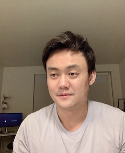

I received my Ph.D. from the Computer Science Department at [Washington University in St. Louis](https://cse.wustl.edu/) under the supervision of [Professor Vorobeychik](http://vorobeychik.com/).

My research interests include machine learning and game theory.

The aim of my research is to develop computational methods that achieve the following:
- Ensure the trustworthiness of machine learning models through game theory concepts.
- Learn the behavior of strategic agents from data.
- Design strategic agents' behavior towards social good.

Email: \[First Name\].\[Last Name\]@wustl.edu
 

